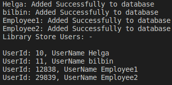
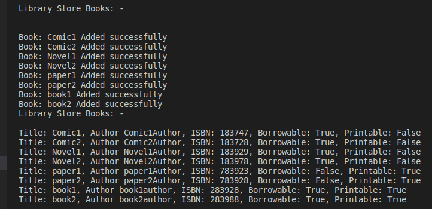
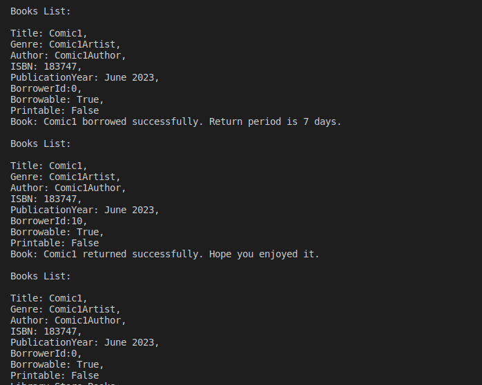
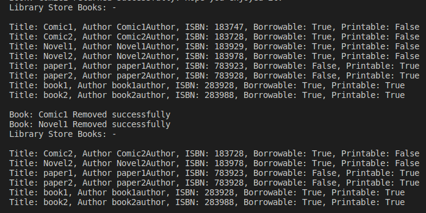
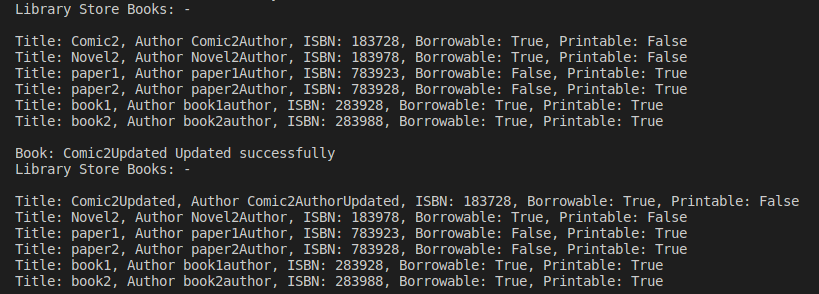
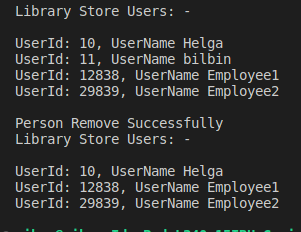
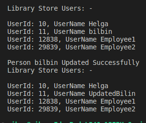

# Assignment: Library Management System

The goal of this assignment is to implement a basic Library Management System as a C# console application. This application will help you practice key principles of Object-Oriented Programming: Encapsulation, Abstraction, Inheritance, and Polymorphism.

## Description

A library has books and users. Users can be either cutomers or librarians. Librarians can add or remove books from the library and also can issue books to customers. Customers can request to borrow or return books. Also, library can have different types of books (Comic, Novel, TextBook, ResearchPaper) as well.

## Installation

Use this command to install dependencies and run the program.

```bash
dotnet restore
dotnet run
```

## Usage

```c#
# create class instance, Users
Library library = Library.Instance();
Customer customer1 = new Customer("Helga", 10);
Customer customer2 = new Customer("bilbin", 11);
Customer customerUpdate = new Customer("UpdatedBilin", 11);

Librarian librarian1 = new Librarian("Employee1", 12838);
Librarian librarian2 = new Librarian("Employee2", 29839);

// add User
Library.AddPerson(customer1);
Library.AddPerson(customer2);

Library.AddPerson(librarian1);
Library.AddPerson(librarian2);

Library.PrintUserList(librarian1.Id);
```



```c#
# create books instance and add them to Library

// creating Books
Comic comic1 = new Comic("Comic1", "Comic1Author", 183747, "June 2023", "Comic1Artist");
Comic comic2 = new Comic("Comic2", "Comic2Author", 183728, "June 2023", "Comic2Artist");
Comic commic2Updated = new Comic("Comic2Updated", "Comic2AuthorUpdated", 183728, "June 2023", "Comic2ArtistUpdated");

Novel novel1 = new Novel("Novel1", "Novel1Author", 183929, "June 2023", "Novel1Genre");
Novel novel2 = new Novel("Novel2", "Novel2Author", 183978, "June 2023", "Novel2Genre");

ResearchPaper researchPaper1 = new ResearchPaper("paper1", "paper1Author", 783923, "June 2023", 100);
ResearchPaper researchPaper2 = new ResearchPaper("paper2", "paper2Author", 783928, "June 2023", 80);

TextBook textBook1 = new TextBook("book1", "book1author", 283928, "June 2023", 400);
TextBook textBook2 = new TextBook("book2", "book2author", 283988, "June 2023", 250);

//Add Books with Librarien id
// Adding Books with user id will give error

Console.WriteLine(library);
Library.Add(comic1, librarian1.Id);
Library.Add(comic2, librarian2.Id);

Library.Add(novel1, librarian1.Id);
Library.Add(novel2, librarian1.Id);

Library.Add(researchPaper1, librarian1.Id);
Library.Add(researchPaper2, librarian1.Id);


Library.Add(textBook1, librarian2.Id);
Library.Add(textBook2, librarian2.Id);

Console.WriteLine(library);
```



```c#
# Borrow and Return books

// Borrow Book and Return with Libraray class

Library.Borrow(comic1, customer1.Id);
//Library.Borrow(comic1, customer2.Id); // can't borrow the book, book not available error.
Library.Return(comic1, customer1.Id);

// Borrow and return with customer class
comic1.PrintInfo();
customer1.Borrow(comic1);
comic1.PrintInfo();
customer1.Return(comic1);
comic1.PrintInfo();
```



```c#
# Remove a book from Library

//Remove a book
Console.WriteLine(library);
Library.Remove(comic1, librarian1.Id);
Library.Remove(novel1, librarian1.Id);
Console.WriteLine(library);

```



```c#
# Edit a book from Library
//Edit a book
Console.WriteLine(library);
Library.Edit(comic2, commic2Updated, librarian1.Id);
Console.WriteLine(library);

```



```c#
# Remove a user
//old State
Library.PrintUserList(librarian1.Id);

// Remove
Library.RemovePerson(customer2);

//updated State
Library.PrintUserList(librarian1.Id);
```



```c#
# Update a user
//old State
Library.PrintUserList(librarian1.Id);

// Edit
Library.EditPerson(customer2, customerUpdate);

//updated State
Library.PrintUserList(librarian1.Id);
```


